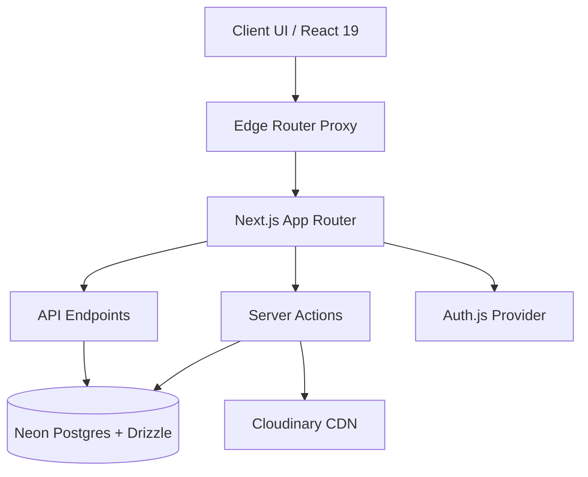

# ⚡ KRATOS 2026 — Technical Documentation

> [!NOTE]
> **For developers and future maintainers.**
> This document covers the core systemic architecture, advanced data modeling, execution boundaries, administrative workflows, and definitive deployment criteria for the KRATOS 2026 festival platform.

---

## 📑 Table of Contents

1. [Architecture Overview](#architecture-overview)
2. [Data Model](#data-model)
3. [Auth & Middleware](#auth--middleware)
4. [Media Handling](#media-handling)
5. [Registration Rules](#registration-rules)
6. [Schedule System](#schedule-system)
7. [Admin Operations](#admin-operations)
8. [Seed & Bootstrap](#seed--bootstrap)
9. [Validation & Build](#validation--build)
10. [Deployment](#deployment)

---

## 🏗️ Architecture Overview

The platform boasts a modern, robust foundation leveraging the **Next.js 16 App Router**, fully utilizing Server Components and Actions as the primary abstraction for data orchestration and state mutation.



### 🗂️ Key Route Groups

| Hierarchy Prefix | Primary Utility |
|:---|:---|
| `/` | Public-facing landing and conversion funnels |
| `/events/*` | Comprehensive event catalog and sub-registrations |
| `/auth/*` | Unified authentication schemas (login, user/admin reg) |
| `/dashboard` | Protected hub for verified participants |
| `/admin/*` | Gated control vectors for core administrators |
| `/api/*` | Extensibility nodes (auth, presence webhooks, data export) |

---

## 💾 Data Model

Relational integrity is governed via **Neon Postgres** via strictly typed schemas compiled by **Drizzle ORM** (`src/db/`).

| Source Table | Entity Description |
|:---|:---|
| `users` | Authenticated actors (Participants and Admins) |
| `events` | Core event paradigms (Fee structures, temporal logistics) |
| `registrations` | Primary linkage for entries mapping payments/status |
| `teams` | Compound abstraction grouping sub-actors under one manifest |
| `schedule_slots` | Master 2-day × 5-slot systemic grid |
| `gallery_photos` | Crowdsourced or CMS-uploaded transient media buffers |
| `system_settings` | Global override flags (Lockouts, Toggles, dynamic Hero Assets) |

> [!TIP]
> Execute synchronous schema injections with `npx drizzle-kit push` prior to production boots.

---

## 🛡️ Auth & Middleware

- **Auth.js v5 beta** provides state-of-the-art dual-vector auth integration:
  - **Google OAuth** — Expedited social ingress
  - **Credentials** — Encrypted email/password fallback vectors
- Contextual Session Types gracefully merge role/id extensions inside `src/types/next-auth.d.ts`.
- **`src/proxy.ts` Edge Guardian**:
  - Automatically isolates unverified traffic
  - Actively repels non-admin entities from `.admin/*` scope
  - Strictly enforces the Profile-Completion pipeline.

---

## 📸 Media Handling

- Media operations (Proofs, Galleries) safely tunnel to **Cloudinary CDN** utilizing `next-cloudinary`.
- Aggressive Next.js optimization scopes restrict domains directly in `next.config.ts`.

> [!IMPORTANT]
> The environment constants `NEXT_PUBLIC_CLOUDINARY_CLOUD_NAME` and `NEXT_PUBLIC_CLOUDINARY_UPLOAD_PRESET` are strictly required to unblock UI upload functionality.

---

## ⚖️ Registration Rules

| Execution Policy | Description |
|:---|:---|
| **Profile Gate** | Mandatory user enrichment prior to action. |
| **Free Engagements** | Frictionless ingress. State auto-morphs to `approved`. |
| **Paid Engagements** | Enforced verification. Transaction ID and image payload inherently required. |
| **Team Dimensions** | Server-enforced limits; mismatch triggers outright payload rejection. |
| **Deduplication** | Strict collision checks prevent re-registration anomalies. |

---

## 📅 Schedule System

Structured precisely for a **2 Day × 5 Slot Configuration**:

| Grid Slot | Allocated Phase Range |
|:---:|:---|
| **1** | 10:30 AM – 11:00 AM |
| **2** | 11:00 AM – 01:00 PM |
| **3** | 01:00 PM – 01:30 PM (Intermission/Lunch) |
| **4** | 01:30 PM – 04:00 PM |
| **5** | 04:00 PM – 05:30 PM |

---

## ⚙️ Admin Operations

> [!NOTE]
> The `/admin/dashboard` operates as a central point of absolute authority.

### Verifications & Actions
- **Payment Verification**: Dedicated visual UI to review attached Cloudinary assets and action `approve` or `reject` states.
- **Dynamic Check-Ins**: Instantly execute participant arrivals via QR scanning logic or textual prefix searches. Marks records as attended with precision timestamps.
- **Global Configs**: Directly overwrite system-wide parameters (Registration Deadlines, Gallery Lockouts, Analytics variables).
- **Embedded CMS**: Zero-code intervention. Upload new hero splash and about headers directly to the global database states to mirror onto the landing pages instantaneously. 

---

## 🌱 Seed & Bootstrap

Located in `src/db/`:

```bash
# Deletes old records and populates new semantic architecture (DANGER IN PROD)
npx tsx src/db/seed.ts

# Directly provisions an admin root user, requiring local shell authority
npx tsx src/db/seed-admin.ts
```

---

## 🛡️ Validation & Build

Always validate integrity locally to catch silent runtime bugs:
```bash
npm run lint          # Next.js ESLint execution
npx tsc --noEmit      # Hard typescript structural evaluations
npm run build         # Triggers Turbopack pre-flight optimizations
```

---

## 🚀 Final Deployment Pipeline

1. **Verify Variables**: Validate all `.env.local` mappings mirror your Host configs.
2. **Push Architecture**: Deploy PostgreSQL tables (`npx drizzle-kit push`).
3. **Provision Root**: Hydrate root admin (`npx tsx src/db/seed-admin.ts`).
4. **Final Domain Verification**: Ensure `NEXT_PUBLIC_SITE_URL` maps truthfully down to exact HTTP(S) configurations.
5. **Clear Local Checks**: Green across `npm run lint` && `npm run build`.
6. **Go Live**. Execute your final provider deploy!
