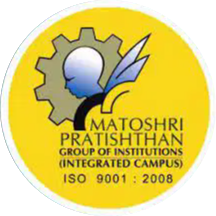

# KRATOS 2026 - MPGI Technical Festival Platform



**KRATOS 2026** is the official web platform for the Annual Technical Festival of Matoshri Pratishthan Group of Institutions (MPGI), School of Engineering, Nanded. 

Designed with a bold "brutalist" aesthetic, this full-stack application serves as the central hub for student registrations, event tracking, administrative moderation, and digital on-campus event verification.

---

## 🌟 Platform Highlights

*   **Student Dashboard:** A personalized space where students view their generated timeline ("My Schedule"), upload event photos, and present their fast-track QR Entry Pass.
*   **Operational Admin Backend:** An extensive control room for organizers. Securely verify payments, manipulate event schedules, and securely check-in attendees via the smartphone QR Web-Scanner.
*   **Walk-in Rescue Terminal:** A highly optimized Fast-Track desk allowing event volunteers to rapidly inject off-the-street registrations into the system in under ten seconds.
*   **Responsive Brutalism:** Styled with raw, high-contrast, edge-to-edge aesthetics utilizing strong borders and bold typography to create a memorable brand identity.
*   **Resilient Architecture:** Bulletproof data pipelines utilizing modern data indexing, global error boundaries, IP-based rate limiting, and an offline fallback service worker for unstable campus networks.

For a non-technical breakdown of how the platform operates day-to-day, please read the [**FEATURES.md**](./FEATURES.md).

---

## ⚙️ Tech Stack & Architecture

This platform leverages modern serverless web architecture to ensure extreme performance during high-traffic registration spikes.

*   **Framework:** Next.js 15 (App Router with Server Components & Server Actions)
*   **Language:** TypeScript
*   **Database:** Neon (Serverless PostgreSQL)
*   **ORM:** Drizzle ORM
*   **Authentication:** NextAuth.js (v5 Beta) - Supporting Google OAuth and secure Local Credentials
*   **Styling:** Tailwind CSS v4 + Framer Motion (for macro-animations)
*   **Media Pipeline:** Cloudinary (for compressed artifact offloading and image transformation)
*   **Deploy Target:** Vercel

---

## 🚀 Quick Start Guide

Follow these steps to spin up the local development environment.

### 1. Requirements
*   Node.js 18+ or 20+
*   npm or pnpm
*   A free Neon Postgres Database URL
*   A Cloudinary account (for image uploads)

### 2. Environment Setup
Rename `.env.example` to `.env.local` and configure your keys.
```bash
cp .env.example .env.local
```

> **Crucial:** Generate your Auth Secret using `npx auth secret`.

### 3. Installation
```bash
npm install
```

### 4. Database Bootstrap
Synchronize the local code schema with your Neon Postgres database.
```bash
npm run db:push
npm run seed:admin
```
*(Note: `seed:admin` securely registers the primary platform super-admin using the credentials provided in your `.env.local`)*

### 5. Launch the Server
```bash
npm run dev
```
Access the application at `http://localhost:3000`.

---

## 🔒 Security & Roles

The system relies on an internal Role-Based Access Control matrix.

*   `PARTICIPANT`: The default role. Can register for events, view their schedule, and upload to the gallery.
*   `VOLUNTEER`: Staff member. Cannot alter event parameters, but can utilize the QR scanner to verify entries and use the Fast-Track Desk.
*   `ADMIN`: Superuser. Total read/write control over events, results, broadcasts, and data export. 

---

## 📄 Documentation

For deep-dive documentation on database schemas and deployment architectures, see [**DOCUMENTATION.md**](./DOCUMENTATION.md).

---
*Built for KRATOS 2026. Code by the Lead Engineering Team.*
